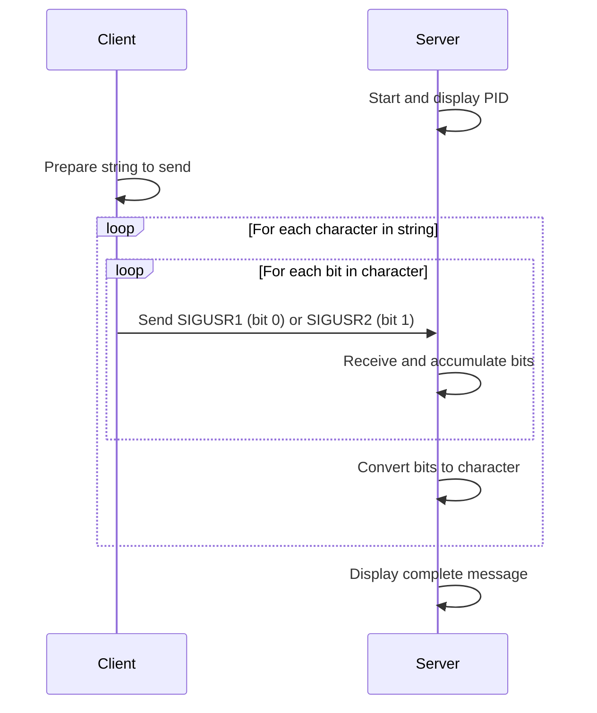

# 📡 Minitalk

## Project Overview

Minitalk is a small data exchange program that implements client-server communication using UNIX signals. This project focuses on creating a communication protocol that allows messages to be sent between a client and server using only SIGUSR1 and SIGUSR2 signals.

## 🎯 Project Objectives

The primary goal is to develop:

- A server that starts first, printing its PID upon launch
- A client that takes two parameters: the server PID and a string to send
- Upon receiving the string, the server must display it
- Communication must use ONLY SIGUSR1 and SIGUSR2 signals

## 📊 Technical Deep Dive

### Signal-Based Communication

UNIX signals are software interrupts that provide a way to handle asynchronous events. In this project, we'll use:

- **SIGUSR1** (User-defined signal 1)
- **SIGUSR2** (User-defined signal 2)

Since we're limited to just two signals, we need to devise a binary encoding/decoding scheme:

```text
SIGUSR1 → Bit 0
SIGUSR2 → Bit 1
```

### Binary Data Transmission Process



### Communication Protocol

1. **Server Initialization**:

   - Server starts and prints its PID
   - Sets up signal handlers for SIGUSR1 and SIGUSR2
   - Waits for incoming signals

2. **Client Operation**:

   - Takes server PID and string as parameters
   - For each character in the string:
     - Converts character to binary (8 bits)
     - Sends each bit as SIGUSR1 (0) or SIGUSR2 (1)
     - Waits for acknowledgment (optional for bonus)

3. **Message Termination**:

   - After sending the full string, client can send a special termination sequence
   - For example, sending a null character (8 zeros)

## 🛠️ Implementation Strategy

### Server Implementation

```c
// Core structure for the server
void handle_signal(int signum);
void setup_signals();
void display_pid();

int main() {
    display_pid();
    setup_signals();
    
    while (1) {
        // Keep the server running and waiting for signals
        pause();
    }
    return 0;
}
```

### Client Implementation

```c
// Core structure for the client
void send_char(int pid, char c);
void send_string(int pid, char *str);

int main(int argc, char **argv) {
    if (argc != 3) {
        // Error handling
        return 1;
    }
    
    int server_pid = atoi(argv[1]);
    char *message = argv[2];
    
    send_string(server_pid, message);
    return 0;
}
```

### Signal Handling Logic

The server will need to:

1. Receive bits (SIGUSR1/SIGUSR2)
2. Buffer the bits until a complete character is formed (8 bits)
3. Convert the buffered bits to a character and display it
4. Clear the buffer for the next character

A sample buffer implementation might look like:

```c
// Global variables
static int g_bit_count = 0;
static unsigned char g_char_buffer = 0;

void handle_signal(int signum) {
    // Shift buffer and add new bit
    g_char_buffer <<= 1;
    if (signum == SIGUSR2)
        g_char_buffer |= 1;  // Set bit to 1 for SIGUSR2
    
    g_bit_count++;
    
    // When we have a complete character (8 bits)
    if (g_bit_count == 8) {
        // Display the character
        write(1, &g_char_buffer, 1);
        
        // Reset buffer and counter for next character
        g_char_buffer = 0;
        g_bit_count = 0;
    }
}
```

The client will need to:

1. Convert each character to binary
2. Send each bit as a signal
3. Use proper timing or acknowledgment to ensure reliability

## ⚠️ Challenges and Considerations

### Signal Reliability

Signals can be lost or delivered out of order. A robust implementation might include:

- Timeouts
- Acknowledgments (bonus part)
- Error detection mechanisms

### Race Conditions

Signal handlers must be carefully designed to avoid race conditions:

- Use volatile variables for shared data
- Be mindful of signal handler limitations

### Unicode Support (Bonus)

Supporting Unicode will require handling multi-byte characters properly:

- Determine the encoding scheme (UTF-8 recommended)
- Handle variable-length characters

## 🚀 Bonus Features

The project offers bonus points for implementing:

1. Server acknowledgment of received signals
2. Unicode character support

## 🔄 Testing Strategy

To verify your implementation:

1. Test with short messages
2. Test with long messages
3. Test with special characters
4. Test with edge cases (empty string, very long string)
5. Test reliability under load

## 🔍 Signal-Based Communication Example

Here's how the binary representation of the character 'A' (ASCII 65 or 01000001) would be transmitted:

| Bit | Value | Signal  |
|-----|-------|---------|
| 0   | 0     | SIGUSR1 |
| 1   | 1     | SIGUSR2 |
| 2   | 0     | SIGUSR1 |
| 3   | 0     | SIGUSR1 |
| 4   | 0     | SIGUSR1 |
| 5   | 0     | SIGUSR1 |
| 6   | 0     | SIGUSR1 |
| 7   | 1     | SIGUSR2 |

## 📝 Final Remarks

This project offers an excellent opportunity to understand:

- Interprocess communication
- Signal handling in UNIX systems
- Binary data representation and transmission
- Robust error handling and protocol design

Remember that signals are asynchronous by nature, which makes this project particularly challenging and rewarding. Pay special attention to reliability, as signal delivery is not guaranteed in all circumstances without proper handling.

---

## 📚 Resources

- UNIX Signal programming: `man 7 signal`
- Signal functions: `man 2 signal`, `man 2 sigaction`, `man 2 kill`, `man 2 pause`
- Process information: `man 2 getpid`
- Binary manipulation: bitwise operators in C